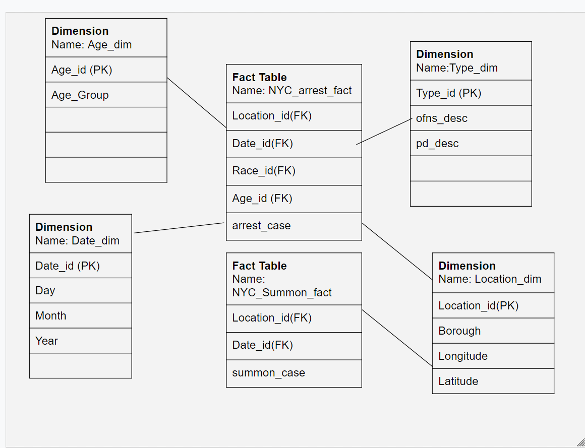
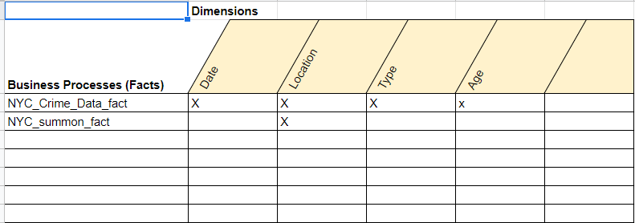

# Cis-9440-Group-12

 NYC Crime Statistics
- author(s): Jordan Wong, Sihan Lin,Xiaodie Zhao,Jie Qu
- date created: 5/5/2022
- class: CIS 9440

Project Objective: Follow the Kimball Lifecycle to design and develop a public, cloud-based Data Warehouse with a functioning BI Applications

Project Tools:
The tools used to build this Data Warehouse were: 
1. For data integration - python
2. For data warehousing - Google BigQuery
3. For Business Intelligence - Tableau

## Kimball Lifecycle Project Stages

### Project Planning

Motivation for project:

NYC's crime rate has been climbing these years and the high crime rate has a huge impact on people’s lives. We want to have a deeper insight into the NYC crime statistic and provide a transparency report to expand awareness of crimes in NYC.

Description of the issues or opportunities the project will address:

Find the crime rate for the major crime category
Improve the procedure and training for certain crimes

Project Business or Organization Value:
Reduce crime
Effectively use police resources.
Provide transparency to the public

Data Sources:
1. NYPD Arrest Data (Year to Date)
2. NYPD Criminal Court Summons Incident Level Data (Year To Date)
...

### Business Requirements Definition

List of Data Warehouse KPI's:
1. Monthly Arrest case by borough
2. Monthly arrest cases by age group
3. Arrest case by type
4. Total arrest case per weekday
5. Percentage of arrest cases over criminal court cases by borough 
...

### Dimensional Model

This project's Dimensional Model consists of (x) Facts and (y) Dimensions

Use correct file path here to show picture of dimensional model...

This project's Kimball Bus Matrix:

Use correct file path here to show picture of dimensional model...

### Business Intelligence Design and Development

List of Visualizations for each KPI:
1. Bar Chart for comparison of ...
2.
3.
...

BI Application Wireframe design:

Use correct file path here to show picture of Wireframe design...

Picture of final Dashboard:

Use correct file path here to show picture of Dashboard...

### Deployment

The project was deployed on Tableau Public: [CIS 9440 Group 12]

(https://public.tableau.com/app/profile/kwoktung.wong/viz/cis9440Group12/Dashboard1?publish=yes)
